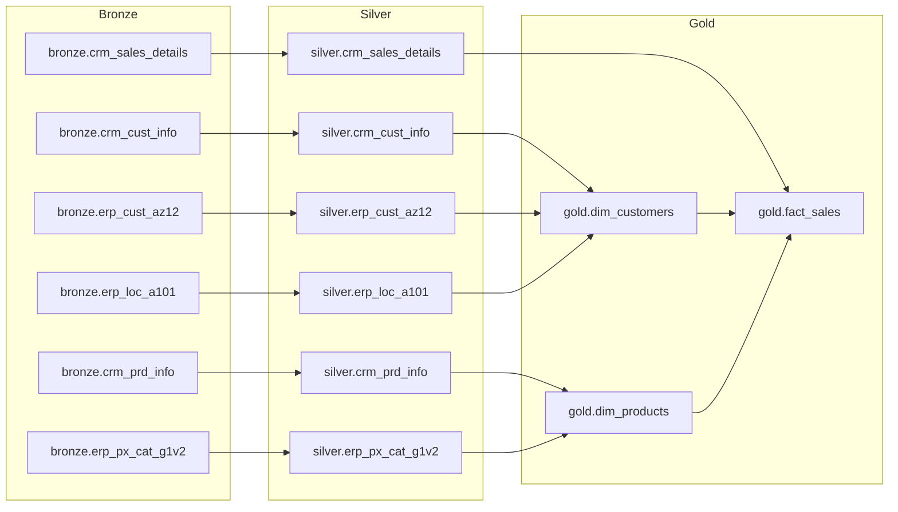

# Data Flow (Lineage)

How each source file moves through the bronze, silver and gold layers.

```mermaid
flowchart LR
    subgraph Bronze
        b1[bronze.crm_cust_info]
        b2[bronze.crm_prd_info]
        b3[bronze.crm_sales_details]
        b4[bronze.erp_cust_az12]
        b5[bronze.erp_loc_a101]
        b6[bronze.erp_px_cat_g1v2]
    end

    subgraph Silver
        s1[silver.crm_cust_info]
        s2[silver.crm_prd_info]
        s3[silver.crm_sales_details]
        s4[silver.erp_cust_az12]
        s5[silver.erp_loc_a101]
        s6[silver.erp_px_cat_g1v2]
    end

    subgraph Gold
        g1[gold.dim_customers]
        g2[gold.dim_products]
        g3[gold.fact_sales]
    end

    b1 --> s1
    b2 --> s2
    b3 --> s3
    b4 --> s4
    b5 --> s5
    b6 --> s6

    s1 --> g1
    s4 --> g1
    s5 --> g1
    s2 --> g2
    s6 --> g2
    s3 --> g3
    g1 --> g3
    g2 --> g3
```
